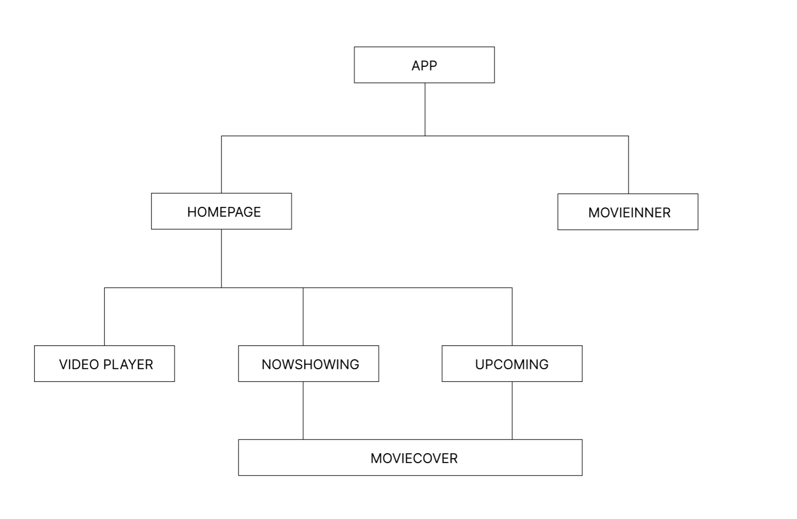

### Netflix Clone With Autoplaying Video Carousel


### Overview

Create a Movie trailer app using The Movie Data API to retrieve the latest movie and upcoming movie data. Users would be able to browse through the movie covers and watch the trailer upon clicking the movie cover. Get the movie synopsis with a click of the view button under the cover.

---

### Documentation (API)

Im using React custom hook and "axios" to fetch my data under my hook folder.

Homepage.jsx line.17
Get latest movie : https://developers.themoviedb.org/3/movies/get-latest-movie

```javascript
const { data, loading, error, refetch } = useFetch(
  `https://api.themoviedb.org/3/movie/now_playing?api_key=${api}&language=en-US&page=1`
);
```

CarouselUpcoming.jsx line.18
Get Upcoming Movies: https://developers.themoviedb.org/3/movies/get-upcoming

```javascript
const { data, loading, error } = useFetch(
  `https://api.themoviedb.org/3/movie/upcoming?api_key=${api}&language=en-US&page=2`
);
```

DisplayMovie.jsx line.6
Get Video: https://developers.themoviedb.org/3/movies/get-movie-videos

```javascript
const { data, loading, error, refetch } = useFetch(
  `https://api.themoviedb.org/3/movie/${props.id}/videos?api_key=${api}&language=en-US`
);
```

### APP Hierarchy



Table of Contents:
App.js : Router 6 for moving home to inner-page
Homepage : Display and Carousel
Reusable component : MovieCover
Movieinner: MovieInner.jsx

Css folder structure Eg:
Example.jsx
Example.css

```
The only exception .css for MovieInner.jsx is in index.css
```

---

####BUILD WITH

<a title="Facebook, Public domain, via Wikimedia Commons" href="https://commons.wikimedia.org/wiki/File:React-icon.svg"></a>

---
